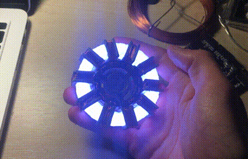
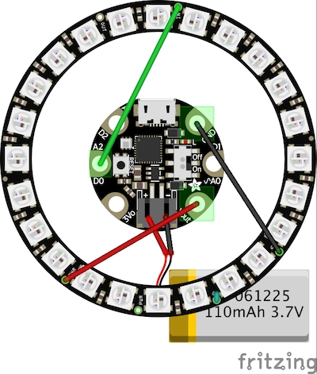

# Arc Reactor

A 3D printed, python powered, Neopixel illuminated, mark1 arc reactor.

## Hardware

The reactor is made of several 3D printed parts :
- an outer "light" ring, printed in transparent PLA,
- 10 brackets in a metallic grey,
- and two stacked center pieces, 

Some thin copper wire is used for the coils outside of the ring, as well a an inner copper coil, which when touched will toggle the reactor on & off.

## Electronics

The reactor is using 2 components : 
- a Adafruit Gemma M0,
- A 24 LED Neopixel ring

and 3 cables to connect everything together. A standard 5v battery can be plugged to the Gemma via its USB port, or a smaller 3.7V Li-Po battery for a true standalone mode.

## Software

The Gemma is running CircuitPython.
The Neopixel ring is controlled via the `neopixel` library, and the inner copper coil touch detection is made via the `touchio` builtin library.

To use, just plug your gemma, and replace the `main.py` file with the one provided.

## Credits & License

The two inner parts of the reactor were made by [zmark](https://www.thingiverse.com/thing:2036876). Kudos to him

This project is under MIT License